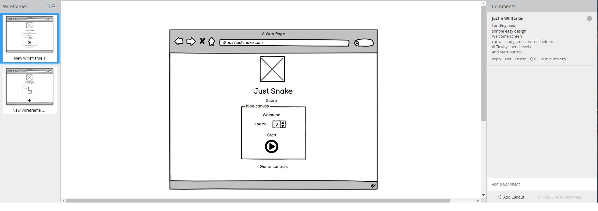
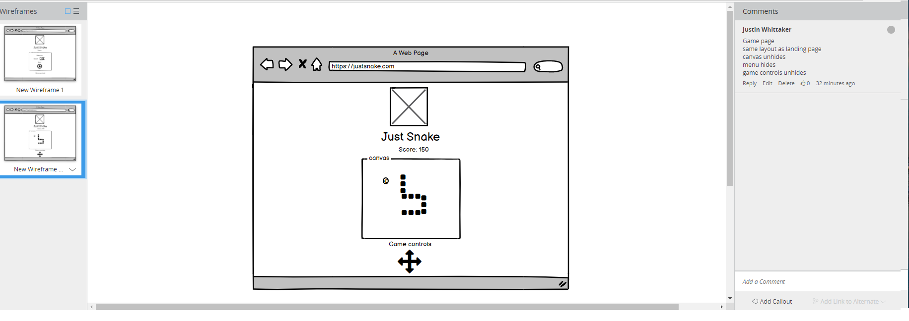
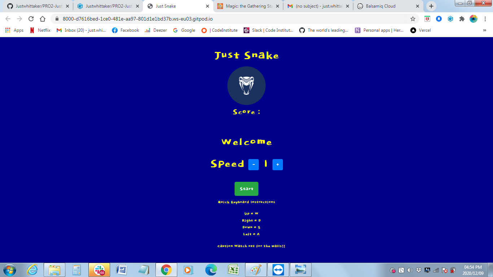
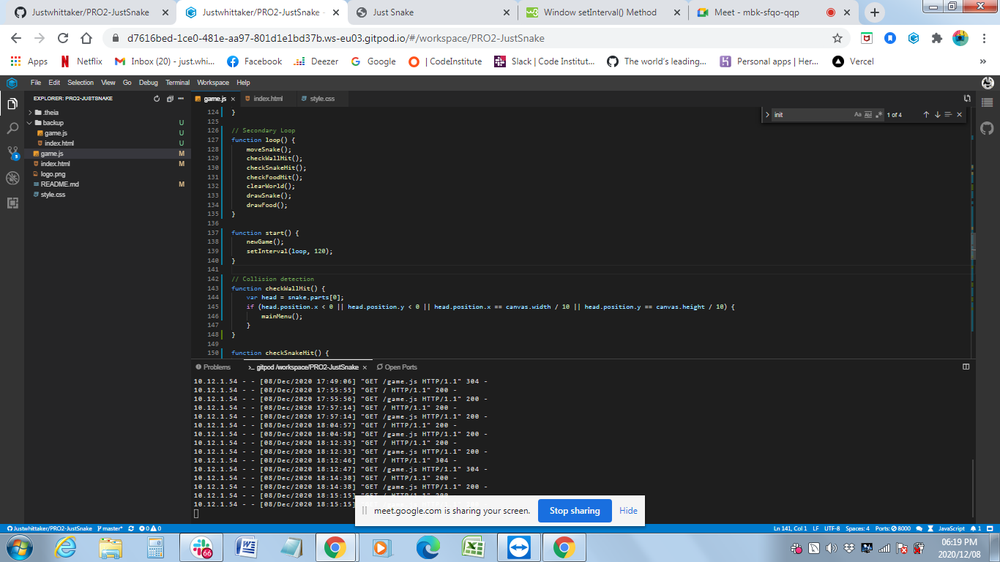

# Milestone Project JavaScript/JQuery

## JUST SNAKE ##

## Contents ##
---

* UX
    * [Project Goals](#project-goals)
    * [User Goals](#user-goals)
    * [User Stories](#user-stories)
    * [User Requirements and Expectations](#requirements)
    * [Design Choices](#design-choices)
        * [Fonts](#fonts)
        * [Icons](#icons)
        * [Colors](#colors)
* [Wireframing](#wireframing)
* [Features](#features)
    * [Features that have been developed](#developed)
    * [Features that will be implemented in the future](#implemented)
* [Technologies](#technologies)
* [Testing](#testing)
* [Issues](#issues)
* [Deployment](#deployment)
* [Credit](#credits)

## UX (User Experience) ##
---

### Project Goals ###

In the early 2000's as technology increased and cellphones had become more accessible with multiple capibilites. 
Cellphone games such as Snake came standard with your cellphone such as the popular Nokia 3110, we all tried betting our top scores. 

The **goal** for this project is to to recreate the poplular game for everyone to enjoy in both the classic format for celluar use as well as for the pc.

### User Goals ###

For the UX on this project I wanted to create a simple and user friendly site. My target audience is all ages, hence I chose vibarant colors. 

* **Testing his/her/their Skills** with **quick reflexes** within the **Boundry**
* **Being entertained** by the game.
* **Score high** on all cards.
* Get a **final score**.
* **Play** the game **again**.

### User Stories ### 

* The **user** wants an **attractive game** witha **non-distracting** background.
* The **user** wants **clear instructions**
* The **user** wants there to be a **score column** so that the user can quickly identify there current score, this **resets** when a new game starts.
* The **user** wants to be **challenged** in his/her/their **skills**
* The **user** wants a **conveint sized canvas box** 
* The **user** wants the game to start **playing immedaitely** 
* The **user** wants to **know** when a **the game is over**.
* The **user** wants to get a maximum of points.
* The **user** wants to **play best for the best score** the game.
* The **user** wants to **have the possibility** to **play again**.

### Research ###

* When developing this **game**, I kept in mind that the aesthetic should be inspired by the classic game. 
* I tried to create a **simple and easy feel** to for a cleaner approach for the game page.
* I checked **previously made snake games** and used **my own experience**.

### Design Choices ###
---

### Fonts ###

* The **landing page** is using the gaming classic **Google Fonts** **Dokdo** for the H1 and H3. 
* I paired it with the **Google Fonts** **Helvetica** for readability.
* The **Game Over page** is using **Dokdo** again for the **H3 page title** paired with **Helvetica** on the **instructions** in the **header**.
* I kept the **Dokdo** font for **better user experience**

### Icons and Images ###

* **The icon** used on the website are provided by [**FontAwesome**](https://fontawesome.com/)
* The **image** used for the **landing page** is a **free image** from the image bank [**PNGtree**](https://PNGtree.com/snake) and (https://pngtree.com/so/apple) with a simple research with the keyword **snake & apple**.

### Colors ###

* The **color scheme** used for the website is a classic **90's gamer palette** composed of a combination of **dark and light green** for the **title** and a **classic bright yellow** for the **buttons** on the **gaming consol** 
 

## Wireframing ##
---
For **wireframing** I used the tool [**Balsamiq**](https://balsamiq.com/).

Please follow the link to find the preview [here] 

href = https://balsamiq.cloud/srsmfvs/pilelvc/r2278

* As you can see this is **a minimal wireframe** and I pushed a few changes for better readability and engagement:
* I added **a full-screen hero image** on the game over page.

## Features ## 
---

### Implemented Features ###

* **Responsiveness** on all screen sizes.
* **large title** for attractiveness and engagement.
* **snake mobiltiy** as an introduction to the theme including Apple for food
* **Instructions** displayed the same page as the game Below the canvas so that the user can grasp the controls immedaitely.
* **Immedaite** game play with Easy and simple snake play
* **Final Score** based on each card score when all cards are played with pictures
* **Game reset** 

### Future implemented features ###

* **Feature 1** - Score keeping and saved high scores.
* **Feature 2** - Menu and different settings
* **Feature 3** - Change color of the snake when it reaches a highscore level

## Technologies used ##

* [HTML](https://developer.mozilla.org/en-US/docs/Web/HTML)
* [CSS](https://developer.mozilla.org/en-US/docs/Web/CSS)
* [Javascript]()
* [JQuery](https://jquery.com/)

**Tools & Libraries**

* [Bootstrap](https://getbootstrap.com/)
* [Font-Awesome](https://fontawesome.com/icons?d=gallery)
* [Google fonts](https://fonts.google.com/)
* [Git](https://git-scm.com/)
* [PNGtree](https://PNGtree.com)

## Testing ##
---

* I tested the responsiveness of the website by using the [**Google Chrome Developer Tool**](https://developers.google.com/web/tools/chrome-devtools) as well as the plug-in **Unicorn Revealer** to control my overflow and the website [**Am I Responsive**](http://ami.responsivedesign.is/). 
* I also tested my website on **different browsers and real devices** : **Iphone 6s, Ipad Pro 12", Ipad Mini, Google Chrome, Safari, Mozilla Firefox and Samsung A70.**
* I used a first **dirty version** of this project on **Gitpod** and **refactored** my code **step by step** to remove any **useless classes**
* I tested my CSS file and my HTML files using [**CSS Validator**](https://jigsaw.w3.org/css-validator/) and [**HTML Validator**](https://validator.w3.org/).
* I tested every **functions** of my script.js using multiple **console.log** and checking for **errors** in the **Google Chrome console**.
* I tested my Javascript files with [**JSHint**](https://jshint.com/).
* All pages passed the HTML,CSS and JS validator final test with no major issues.

**Responsiveness**

* **Implementation** 

* I used **Bootstrap** as well as **flexbox and custom CSS media queries** to ensure that the website didn't break on all screen sizes.

**Landing Page**

* **Implementation** 

* I decided to keep it simple with the **landing page and game page** as one. 
* I liked the **key master** property better than the **on click** for the controls because I want to let the **user decide** on which control is easier. However On Click is needed to make the game touch screen sensitive and thus mobile friendly.
* The snake canvas and controls are made only with **HTML5 and CSS3** and are **responsive** on all screen sizes.
* As stated above, I wanted to create an classic 90's gamer feel so I used bright colors and fun fonts
 
**Game Score**

 

* **Implementation**

* Each **apple** is linked to a **score counter** variable passed in a **function** which allows to **add up the scores per apple**
* The **Game Score** is entirely made with **Javascript**.
* At the **end** of each **game** a **mainMenu** appears, stating the **game score** and giving a **start message**,

## Issues ##
---

**During development**

* I had a major issue with my script.js file after everything was done because of this issue:

I did not understand what was going on but it casued my javascript loop to duplicate after refreshing and caused the game to speed up after every end of the game. To fix this issue I created an if statement to clearInterval which stopped this from happening.

newGame();
    if (loopIntervalId) {
        clearInterval(loopIntervalId);
    }
    loopIntervalId = setInterval(loop, 120/speed);
}

* After I put my **project** up for **peer-review**, it was brought to my attention that the **game needed a menu** was not very mobile friendly on **mobile**. I fixed it by **adding** the **mainMenu** variable and simply adding **a few buttons to toggle play** for mobile users.
* After my **mentor call** and my **peer-code-review** I realized that I needed to add some **difficulty levels** code for the **game play** and created the **speed variable** by using **if statements** and **return** properties.

## Deployment ##
---
**JustSnake** was developed on **GitPod**, using **GitHub** to host the repository and deployed on **GitHub Pages**.
**GitHub** made the deployment extremely painless:

* Connected to Github
* Selected the repository **JustWhittaker/PRO2-JustSnake**
* Clicked on **"settings"** in the navigation bar
* In the **GitHub Pages** I selected **Master Branch** and **/root** in the dropdown menu and clicked **Save**
* I waited 2 minutes.
* **The website is now live on https://justwhittaker.github.io/PRO2-JustSnake/**.

**Cloning** No issues:

* In my repository **JustWhittaker/PRO2-JustSnake**, click on the **"Code** green button, **copy in clipboard the HTTPS link**, open your **IDE** and look through my files.
* The link : **https://github.com/JustWhittaker/PRO2-JustSnake.git**

## Credits ##
---

**Text Credits:**

* All text content has been written by Justin Whittaker.

I received inspiration and technical knowledge for this project from the following platforms
1. Alignment  
https://www.w3schools.com/tags/att_img_align.asp 
https://www.w3schools.com/graphics/game_canvas.asp

2. JQuery  
https://stackoverflow.com/a/1527820/2124254  
https://tutorialzine.com/2015/06/making-your-first-html5-game-with-phaser 
https://github.com/infusion/HTML5-Experiments/blob/master/html5-snake.html 
https://www.html5canvastutorials.com/advanced/html5-canvas-snake-game/  
https://stackoverflow.com/questions/10879955/how-to-align-an-image-dead-center-with-bootstrap 
https://developers.google.com/speed/libraries

3. JQuery research  
    1. CodeInstitute Java Funadementals - "Var","if", "Else if", "arrays" and "axis"  
    2. https://www.w3schools.com/js/js_random.asp  
    3. https://www.w3schools.com/tags/canvas_arc.asp

4. Better Git Commit terms  
http://karma-runner.github.io/5.0/dev/git-commit-msg.html

5. Dependencies  
    1. keymaster.js [https://github.com/madrobby/keymaster]// https://www.npmjs.com/search?q=keymaster  
    2. JQuery (html js middleware)  
    The project uses JQuery to simplify DOM manipulation.  
    3. bootstrap 

**Many thanks to:**

* My mentor **Ignatius Ukwuoma** for his patience and kindness
* **AudreyLL88** for her very inspiring ReadME
* **Code Institute Slack community** for the technical and emotional support
* **Carl Lubbe**, for all the assistance and help with guidence and UX

**Site for educational purposes only!**

 (for now)
// Debug
### GITpod Debug
ReferenceError: key is not defined
    at Object. (/workspace/PRO2-JustSnake/game.js:28:1)
    at Module._compile (internal/modules/cjs/loader.js:1135:14)
    at Object.Module._extensions..js (internal/modules/cjs/loader.js:1158:10)
    at Module.load (internal/modules/cjs/loader.js:986:32)
    at Function.Module._load (internal/modules/cjs/loader.js:879:14)
    at Function.executeUserEntryPoint [as runMain] (internal/modules/run_main.js:71:12)
    at internal/main/run_main_module.js:17:47

### Nu HTML Checker
https://validator.w3.org/nu/?doc=https%3A%2F%2Fgithub.com%2FJustwhittaker%2FPRO2-JustSnake
   
Nu Html Checker This tool is an ongoing experiment in better HTML checking, and its behavior remains subject to change

Showing results for https://github.com/Justwhittaker/PRO2-JustSnake Checker Input and points of fixes and debugging noted Show sourceoutlineimage report

